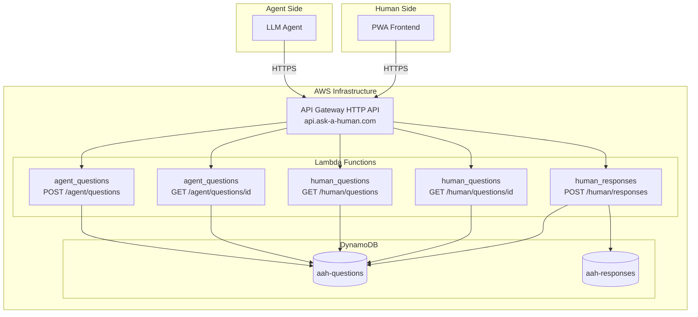

# Minimal Working API Implementation Plan

## Overview

This plan implements the core API infrastructure: API Gateway HTTP API, Lambda functions for 5 endpoints, IAM roles, and Terraform modules. The goal is a working vertical slice of the question-answer loop.

**Runtime**: Python 3.14 (latest AWS Lambda supported version)

---

## Architecture




---

## Implementation Phases

### Phase 1: Backend Application Code

Create Python Lambda handlers in `backend-app/`.

**Directory Structure:**

```
backend-app/
├── src/
│   ├── handlers/
│   │   ├── __init__.py
│   │   ├── agent_questions.py    # POST + GET /agent/questions
│   │   └── human_api.py          # GET /human/questions, POST /human/responses
│   ├── models/
│   │   ├── __init__.py
│   │   ├── question.py           # Question data class + DynamoDB operations
│   │   └── response.py           # Response data class + DynamoDB operations
│   └── utils/
│       ├── __init__.py
│       ├── dynamodb.py           # DynamoDB client wrapper
│       └── api_response.py       # Standardized API response helpers
├── requirements.txt
├── tests/                        # Unit tests (optional for MVP)
└── README.md
```

**Key Files:**

- `[backend-app/src/handlers/agent_questions.py](backend-app/src/handlers/agent_questions.py)`: Handles `POST /agent/questions` (create question) and `GET /agent/questions/{id}` (poll for responses)
- `[backend-app/src/handlers/human_api.py](backend-app/src/handlers/human_api.py)`: Handles `GET /human/questions`, `GET /human/questions/{id}`, and `POST /human/responses`
- `[backend-app/src/models/question.py](backend-app/src/models/question.py)`: Question model with DynamoDB CRUD operations
- `[backend-app/src/models/response.py](backend-app/src/models/response.py)`: Response model with DynamoDB operations

**Core Logic:**

1. **Create Question**: Generate `q_` prefixed ID, calculate `expires_at`, store in DynamoDB with status `OPEN`
2. **Poll Question**: Fetch question + all responses from both tables, return aggregated view
3. **List Open Questions**: Query ByStatus GSI for `OPEN` and `PARTIAL` status
4. **Submit Response**: Generate `r_` prefixed ID, store response, increment `current_responses` count, update status to `CLOSED` if `min_responses` reached

---

### Phase 2: Terraform Lambda Module

Create reusable Lambda module at `[infrastructure/terraform/modules/lambda/](infrastructure/terraform/modules/lambda/)`.

**Files:**

- `main.tf`: Lambda function, IAM role, CloudWatch log group
- `variables.tf`: function_name, handler, runtime, environment_variables, dynamo_table_arns
- `outputs.tf`: function_arn, invoke_arn, function_name

**IAM Policy** (least privilege):

```hcl
# DynamoDB access for questions and responses tables
statement {
  effect = "Allow"
  actions = [
    "dynamodb:GetItem",
    "dynamodb:PutItem",
    "dynamodb:UpdateItem",
    "dynamodb:Query"
  ]
  resources = var.dynamo_table_arns  # Tables + GSI indexes
}
```

**Lambda Configuration:**

- Runtime: `python3.14`
- Memory: 256 MB (sufficient for DynamoDB operations)
- Timeout: 10 seconds
- Environment variables: `QUESTIONS_TABLE`, `RESPONSES_TABLE`

---

### Phase 3: Terraform API Gateway Module

Create API Gateway module at `[infrastructure/terraform/modules/api/](infrastructure/terraform/modules/api/)`.

**Files:**

- `main.tf`: HTTP API, custom domain, routes, integrations, stage
- `variables.tf`: domain_name, certificate_arn, lambda_integrations, cors_origins
- `outputs.tf`: api_endpoint, custom_domain_target

**Key Resources:**

```hcl
# HTTP API (cheaper than REST API)
resource "aws_apigatewayv2_api" "main" {
  name          = "aah-api"
  protocol_type = "HTTP"
  cors_configuration {
    allow_origins = var.cors_origins
    allow_methods = ["GET", "POST", "OPTIONS"]
    allow_headers = ["Content-Type", "X-Fingerprint"]
  }
}

# Custom domain with existing ACM certificate
resource "aws_apigatewayv2_domain_name" "api" {
  domain_name = "api.ask-a-human.com"
  domain_name_configuration {
    certificate_arn = var.certificate_arn
    endpoint_type   = "REGIONAL"
    security_policy = "TLS_1_2"
  }
}
```

**Routes:**

- `POST /agent/questions` -> agent_questions Lambda
- `GET /agent/questions/{question_id}` -> agent_questions Lambda
- `GET /human/questions` -> human_api Lambda
- `GET /human/questions/{question_id}` -> human_api Lambda
- `POST /human/responses` -> human_api Lambda

---

### Phase 4: Wire Modules in Production Environment

Update `[infrastructure/terraform/environments/prod/main.tf](infrastructure/terraform/environments/prod/main.tf)` to instantiate new modules.

```hcl
module "lambda_agent_questions" {
  source = "../../modules/lambda"
  
  function_name = "aah-agent-questions"
  handler       = "src.handlers.agent_questions.handler"
  runtime       = "python3.14"
  source_dir    = "${path.module}/../../../../backend-app"
  
  environment_variables = {
    QUESTIONS_TABLE = module.database.questions_table_name
    RESPONSES_TABLE = module.database.responses_table_name
  }
  
  dynamo_table_arns = module.database.all_table_and_index_arns
}

module "api" {
  source = "../../modules/api"
  
  domain_name     = "api.ask-a-human.com"
  certificate_arn = aws_acm_certificate.main.arn
  cors_origins    = ["https://ask-a-human.com"]
  
  lambda_integrations = {
    "POST /agent/questions"              = module.lambda_agent_questions.invoke_arn
    "GET /agent/questions/{question_id}" = module.lambda_agent_questions.invoke_arn
    # ... etc
  }
}
```

---

### Phase 5: Deploy and Verify

1. **Deploy Lambda code**: Terraform will zip and upload `backend-app/src/`
2. **Apply Terraform**: Creates API Gateway, Lambda functions, IAM roles
3. **Note API Gateway domain**: From Terraform output `api_custom_domain_target`
4. **Add DNS at IONOS**: CNAME `api.ask-a-human.com` -> API Gateway domain
5. **Test with curl**: Follow the testing plan from the task

---

## Key Implementation Details

### Question ID Generation

```python
import uuid
from datetime import datetime

def generate_question_id():
    return f"q_{uuid.uuid4().hex[:12]}"
```

### Status Transitions


| Event                   | Status Change               |
| ----------------------- | --------------------------- |
| Question created        | -> `OPEN`                   |
| First response received | `OPEN` -> `PARTIAL`         |
| `min_responses` reached | -> `CLOSED`                 |
| `expires_at` passed     | -> `EXPIRED` (TTL deletion) |


### DynamoDB Access Patterns

- **Create question**: PutItem to questions table
- **Get question + responses**: GetItem from questions, Query responses by question_id
- **List open questions**: Query ByStatus GSI with status IN (`OPEN`, `PARTIAL`)
- **Submit response**: PutItem to responses, UpdateItem to questions (increment count + conditional status update)

---

## DNS Configuration (Manual Step)

After Terraform apply, add CNAME record at IONOS:


| Type  | Name | Value                                              |
| ----- | ---- | -------------------------------------------------- |
| CNAME | api  | `<api_custom_domain_target from terraform output>` |


---

## Out of Scope (Per Task)

- Rate limiting, idempotency keys, fingerprint validation (Task 03+)
- Gamification/points calculation (Task 04+)
- Push notifications (Task 05+)
- X-Agent-Id header validation (Task 03+)

---

## Risks and Mitigations


| Risk                              | Mitigation                                                                 |
| --------------------------------- | -------------------------------------------------------------------------- |
| ACM certificate not yet validated | Check certificate status before deploy; complete DNS validation if pending |
| Cold start latency                | Accept for MVP; can add provisioned concurrency later                      |
| Lambda deployment package size    | Keep dependencies minimal (`boto3` is included in Lambda runtime)          |


